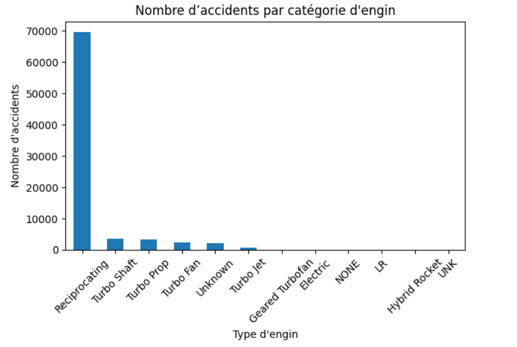
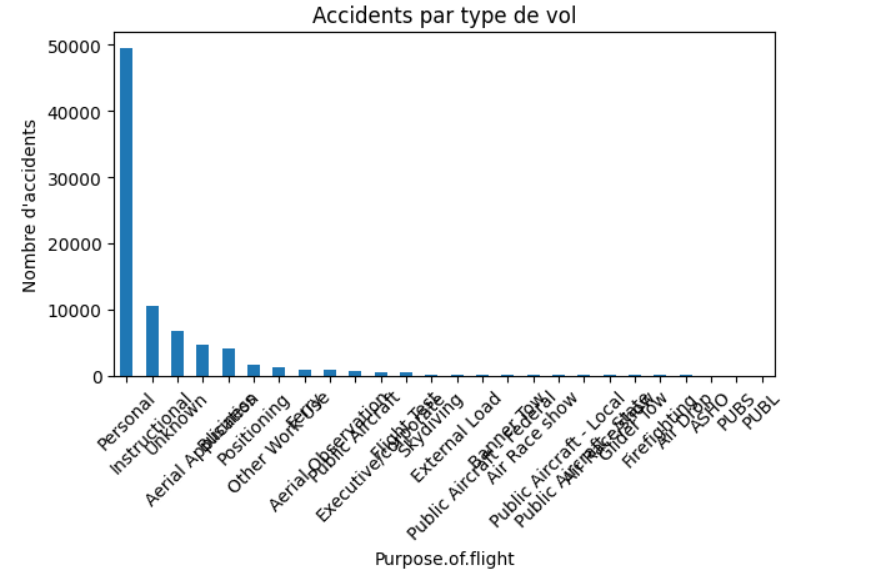
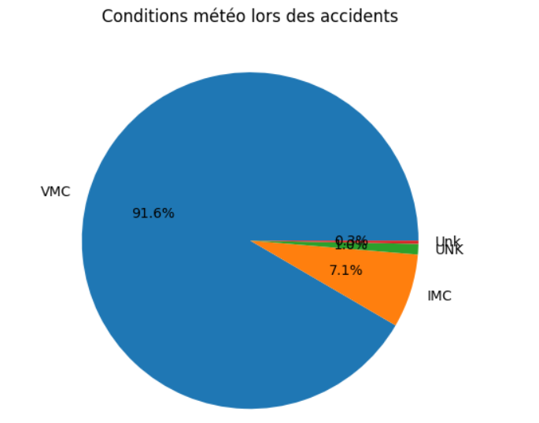
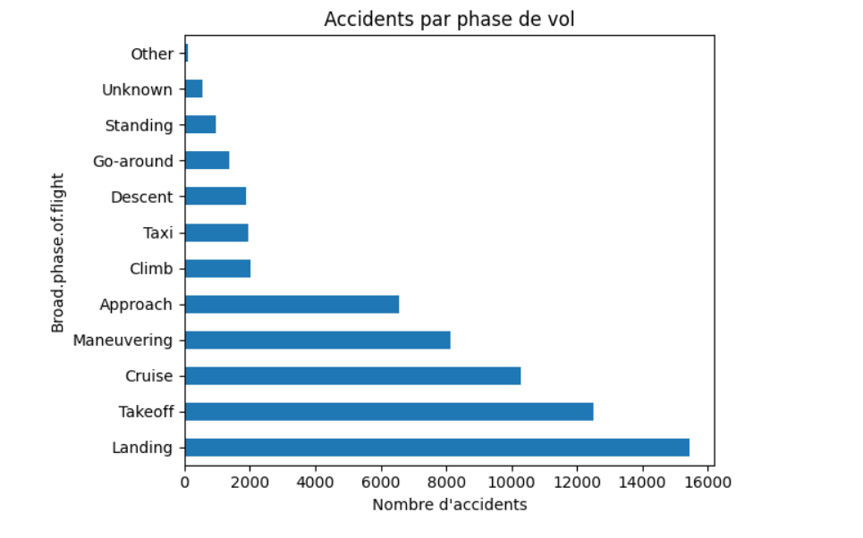

# Picture here
# Analysis of Aviation Accident
## Overview
For this project, I will use data cleaning, imputation, analysis, and visualization to generate insights for my company for its integration in the purchasing and operating airplanes for commercial and private enterprises.
## Business Understanding
Our company expands into the aviation sector, it is very important to begin with a clear understanding of the business objectives and associated risks. The primary goal is to identify and acquire aircraft that offer the lowest operational and safety risks while aligning with our strategic intent—whether in commercial passenger service, private charters, or both. This requires evaluating aircraft not just for initial cost, but for long-term reliability, safety record, regulatory compliance, and total cost of ownership. By establishing a strong foundation of risk-informed decision-making, we aim to ensure operational efficiency, protect our brand reputation, and position the aviation division for sustainable growth in a highly regulated and safety-sensitive industry.
## Data Understanding
The dataset contains aviation-related records that can be used to analyze incidents, accidents, and operational risks in the industry. It includes attributes such as the date and location of the event, aircraft type, operator, injury severity, and weather conditions. Understanding the distribution and relationship between these variables is essential for identifying trends, such as the most common causes of incidents, the aircraft models most frequently involved, or high-risk geographic areas.

## Analysis and Results/Recommendations

1. Contrary to expectations, many accidents occured in favorable weather conditions VMC Strengthen training for pilots in all weather conditions
2. Encourage commercial flights instead of personal flights
3. Favor device with few serious accidents in the database.
## Conlusion and Next Steps
In this project, We've learned a lot about Aviation Accident and How to approach the Aviation sector and the risks for our company. In the Analysis of the data we've learned that is most careful to Avoid flights in adverse weather, Favor device with few serious accidents in the database.

Next Step
Avoid investing in aircraft most often involved in personal accidents.

Focus on safe aircraft during cruise approach
## Repo Structure
