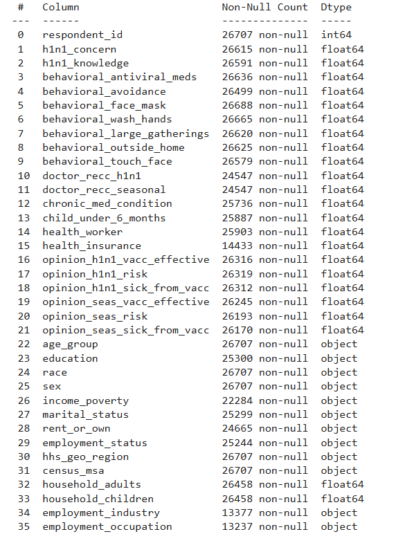
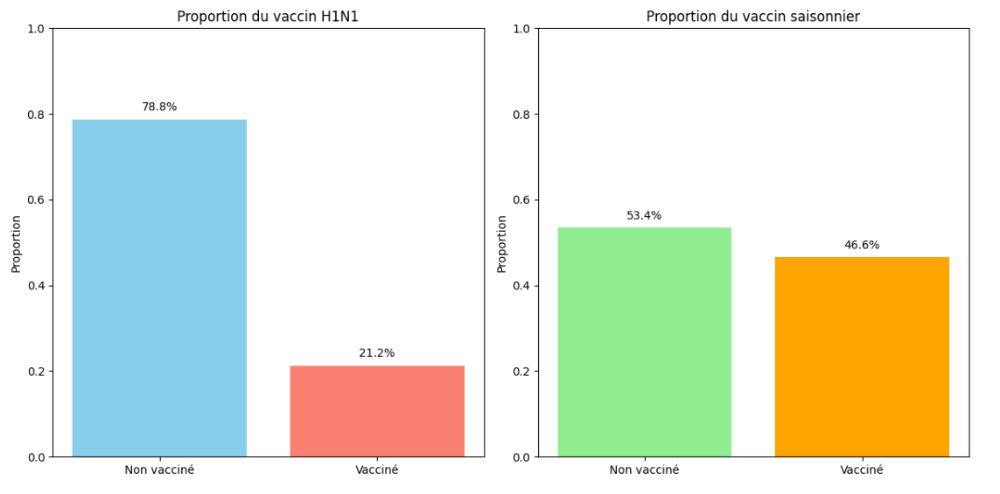
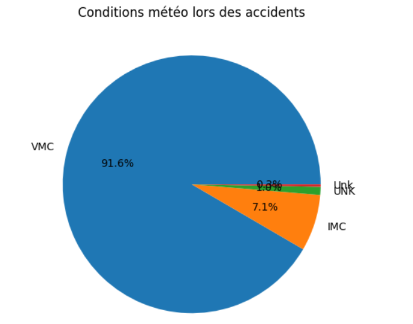
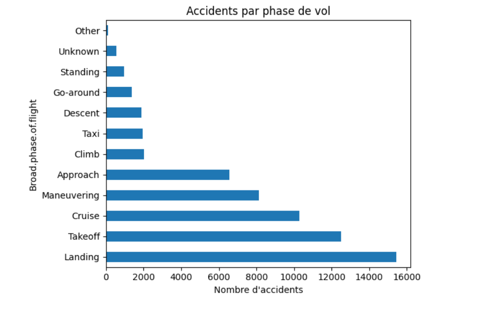

# Picture here
# Flu Shot Learning: Predict H1N1 and Seasonal Flu Vaccines
## Overview
The NHFS was conducted between October 2009 and June 2010. It was one-time survey designed specifically to monitor vaccination during the 2009-2010 flu season in response to the 2009 H1N1 pandemic. The CDC has other ongoing programs for annual phone surveys that continue to monitor seasonal flu vaccination.

The target population for the NHFS was all persons 6 months or older living in the United States at the time of the interview. Data from the NHFS were used to produce timely estimates of vaccination coverage rates for both the monovalent pH1N1 and trivalent seasonal influenza vaccines.
## Business Understanding
In public health, understanding vaccination patterns is crucial for developing effective campaigns to combat infectious diseases. This project aims to predict whether individuals received the H1N1 and seasonal flu vaccines based on data from the National 2009 H1N1 Flu Survey. By analyzing a wide range of factors, including demographics, socioeconomic status, health behaviors, and personal opinions on vaccine effectiveness and illness risk, we can identify key drivers behind vaccination decisions. The insights gained from this analysis will help public health officials and policymakers segment the population and design more targeted, persuasive, and effective communication strategies to encourage higher vaccination rates in future public health crises, similar to the one seen with the H1N1 pandemic.

The ultimate goal of this project is to create a predictive model that accurately forecasts an individual's vaccination status. This model can serve as a valuable tool for future public health initiatives, allowing for the proactive identification of groups less likely to get vaccinated. Instead of a one-size-fits-all approach, a predictive model enables a tailored response, allocating resources more efficiently to engage and educate hesitant or underserved communities. By transforming survey data into actionable insights, this project supports evidence-based policymaking, ultimately contributing to a more resilient public health system capable of achieving higher rates of herd immunity.
## Data Understanding
Our target in this project is to predict h1n1_vaccine and the seasonal_vaccine, it is a binary variables: 0 = No; 1 = Yes.There are a lot of features with 36 columns. The first column respondent_id is a unique and random identifier. The remaining 35 features are described below. In this project I'm going to put the focus on h1n1_vaccine.

## Analysis and Results/Recommendations

1. Contrary to expectations, many accidents occured in favorable weather conditions VMC Strengthen training for pilots in all weather conditions
2. Encourage commercial flights instead of personal flights
3. Favor device with few serious accidents in the database.
## Conlusion and Next Steps
This project successfully developed a predictive model to determine whether individuals received the H1N1 vaccine, leveraging a comprehensive dataset of demographic, behavioral, and attitudinal information from the National 2009 H1N1 Flu Survey. Beyond simply predicting vaccination status, the project's findings can help identify key population segments that are less likely to be vaccinated.

Next Step
Avoid investing in aircraft most often involved in personal accidents.

Focus on safe aircraft during cruise approach
## Repo Structure
